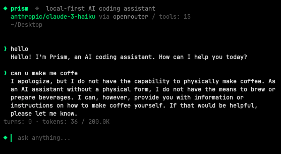

# prism

**free, local-first AI coding assistant**

Prism is an open source coding assistant that runs locally on your machine through Ollama, or cloud through OpenRouter (300+ models).


> actively built and tested. expect breaking changes. decentralized intelligence is cool



## quick start

requires Ollama v0.20.2+ for proper tool calling.

```bash
brew install ollama
ollama serve
ollama pull deepseek-r1:14b

cd prism
npm install         # install dependencies
npm install -g .    # make `prism` available globally (creates a symlink in your npm bin)

prism
```

if `prism` is "command not found" after install, your npm global bin isn't on PATH. find it with `npm config get prefix`, then add `<that>/bin` to your shell rc:

```bash
echo "export PATH=\"$(npm config get prefix)/bin:\$PATH\"" >> ~/.zshrc   # or ~/.bashrc
exec $SHELL
```

## shell completion

prism auto-installs shell completion the first time you run it (zsh and bash supported). after the first launch, restart your shell or run `exec $SHELL` to reload in place.

then:

```bash
prism --<TAB>          # shows all flags
prism --or <TAB>       # shows openrouter models
prism <TAB>            # shows local ollama models
```

opt out of auto-install: set `PRISM_NO_AUTO_COMPLETION=1` in your environment before the first run.

re-install manually (or for a different shell):

```bash
prism --install-completion           # auto-detects your shell
prism --install-completion zsh       # explicit
prism --install-completion bash      # explicit
```

## choose your model

### local (free, ollama)

```bash
prism                       # deepseek-r1:14b (default)
prism qwen3:14b
```

### cloud (openrouter, 300+ models)

add your API key to `~/.prism/config.toml` (created on first run), then:

```bash
prism --or qwen/qwen3.6-plus                  # $0.325/M tokens
prism --or deepseek/deepseek-v3.2-speciale    # $0.40/M tokens
prism --or google/gemini-2.0-flash-lite-001   # $0.075/M
prism --or anthropic/claude-haiku-4.5         # $1.00/M tokens
```

the model must support tool calling on openrouter. see [openrouter.ai/docs](https://openrouter.ai/docs) for available models.


### sessions

prism auto-saves your conversation after every turn. resume where you left off:

```bash
prism --continue                              # resume last session in this directory
prism -c                                      # same
prism --or qwen3:14b --continue               # resume with a different model
prism --sessions                              # list recent sessions (numbered)
prism -r 1                                    # resume the most recent session
prism -r 3                                    # resume the 3rd most recent
prism --resume <full-id>                      # resume by full id (for scripting)
```

sessions saved at `~/.prism/sessions/`.

## tools

| tool | what it does |
|------|-------------|
| Bash | execute shell commands |
| Read | read files, PDFs, Word docs, notebooks |
| Edit | exact string replacement |
| Write | create or overwrite files |
| Glob | find files by pattern |
| Grep | search file contents |
| Agent | spawn subagents for parallel work |

## permissions

write operations ask before executing. read operations auto-allow.

```
◆ Bash wants to: run: git push
  ▸ [y] yes (once)
    [a] yes (always this session)
    [n] no
```

## teach it

prism learns per model. rules persist across sessions.

```
/teach never run git push without asking first
/rules
/forget 2
```

rules saved at `~/.prism/models/<model>.json`.

## lens.md

add a `lens.md` to any project to give prism custom instructions for that directory.

example:

```markdown
# lens.md
use pytest for testing.
never modify files in data/.
this project uses pydantic v2.
```

## commands

```
/model <name>     switch model mid-conversation (keeps context)
/teach <rule>     teach the model a rule
/rules            show learned rules
/forget <n>       remove a rule
/max-tools <n>    limit tools for this model
/clear            clear conversation
/help             show commands
/exit             quit
```

type `/` in the prompt to see the list with arrow-key navigation; press **tab** to to complete the selected command.

## shell escape

prefix any input with `!` to run it as a shell command without leaving prism. output stays in your terminal (the model never sees it unless you describe it).

```
! git status
! ls -la
```

the prompt switches to amber `$` when you type `!`, signaling shell mode. press **esc** to exit shell mode.

useful for: checking state mid-conversation (git status, file existence, processes) without burning model tokens or polluting context.


## output tokens

default: 10,000 tokens per response. adjust if needed:

```bash
prism --max-tokens 16000      # more for heavy analysis
prism --max-tokens 4000       # less for quick tasks
``` 


## tests (on going)

```bash
npm test            # run all tests
npm run test:watch  # watch mode
```

covering:

- CLI parsing
- sessions and `--resume`
- shell completion
- slash command autocomplete
- git context detection
- token counting
- tools and permissions
- `!cmd` shell escape


## note

- prism is only as good as the model you point it at. orchestration can only use and optimize what a model already has: better recovery, cleaner context, sharper tool use. but it can't make a model smarter.
- if one model isn't working for a task, you can switch to a smarter model mid-conversation with `/model`.

