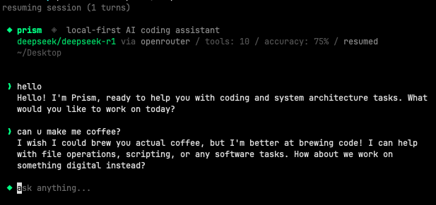

# prism

**free, local-first AI coding assistant**

Prism is an open source coding assistant that runs locally on your machine. you give it a task, it reads your code, edits files, runs commands...
powered by Ollama. but not exclusively, other providers will be added soon.

> actively built and tested. expect breaking changes. decentralized intelligence is cool



## quick start

requires Ollama v0.20.2+ for proper tool calling.

```bash
brew install ollama
ollama serve
ollama pull deepseek-r1:14b

cd prism
npm install
sudo ln -s $(pwd)/bin/prism /usr/local/bin/prism

prism
```

## choose your model

### local (free, ollama)

```bash
prism                       # deepseek-r1:14b (default)
prism qwen3:14b             # best balance
```

### cloud (openrouter, 200+ models)

add your API key to `~/.prism/config.toml` (created on first run), then:

```bash
prism --or qwen/qwen3.6-plus                  # $0.325/M tokens * most recommended for now 
prism --or deepseek/deepseek-v3.2-speciale    # $0.40/M tokens
prism --or google/gemini-2.0-flash-lite-001   # $0.075/M
prism --or anthropic/claude-haiku-4.5         # $1.00/M tokens
```

the model must support tool calling on openrouter. see [openrouter.ai/docs](https://openrouter.ai/docs) for available models.

### sessions

prism auto-saves your conversation after every turn. resume where you left off:

```bash
prism --continue                              # resume last session in this directory
prism -c                                      # same
prism --or qwen3:14b --continue    # resume with a different model
prism --sessions                              # list recent sessions
```

sessions saved at `~/.prism/sessions/`.

## tools

| tool | what it does |
|------|-------------|
| Bash | execute shell commands |
| Read | read files, PDFs, Word docs, notebooks |
| Edit | exact string replacement |
| Write | create or overwrite files |
| Glob | find files by pattern |
| Grep | search file contents |
| Agent | spawn subagents for parallel work |

## permissions

write operations ask before executing. read operations auto-allow.

```
◆ Bash wants to: run: git push
  ▸ [y] yes (once)
    [a] yes (always this session)
    [n] no
```

## teach it

prism learns per model. rules persist across sessions.

```
/teach never run git push without asking first
/rules
/forget 2
```

rules saved at `~/.prism/models/<model>.json`.

## lens.md

add a `lens.md` to any project to give prism custom instructions for that directory.

example:

```markdown
# lens.md
use pytest for testing.
never modify files in data/.
this project uses pydantic v2.
```

## commands

```
/model <name>     switch model mid-conversation (keeps context)
/teach <rule>     teach the model a rule
/rules            show learned rules
/forget <n>       remove a rule
/max-tools <n>    limit tools for this model
/clear            clear conversation
/help             show commands
/exit             quit
```

## output tokens

default: 10,000 tokens per response. adjust if needed:

```bash
prism --max-tokens 16000      # more for heavy analysis
prism --max-tokens 4000       # less for quick tasks
```

## note

different models have different strengths. tool calling, reasoning.. quality varies. some will outperform others while others will do very badly.
but I'm actively closing the gaps as best as possible. 
