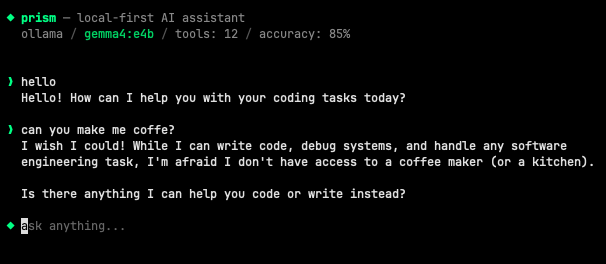

# prism

**free, local-first AI assistant**

Prism is an open source coding assistant that runs locally on your machine. you give it a task, it reads your code, edits files, runs commands...
powered by Ollama. but not exclusively, other providers will be added soon.

> actively built and tested. expect breaking changes. decentralized intelligence is cool



## quick start

```bash
brew install ollama
ollama serve
ollama pull gemma4:e4b

cd prism
npm install
./bin/prism
```

## choose your model

```bash
prism                     # default (gemma4:e4b)
prism qwen2.5-coder:7b   # qwen
prism llama3.2            # llama
```

## tools

| tool | what it does |
|------|-------------|
| Bash | execute shell commands |
| Read | read files with line numbers |
| Edit | exact string replacement |
| Write | create or overwrite files |
| Glob | find files by pattern |
| Grep | search file contents |

## permissions

write operations ask before executing. read operations auto-allow.

```
◆ Bash wants to: run: git push
  ▸ [y] yes (once)
    [a] yes (always this session)
    [n] no
```

## teach it

prism learns per model. rules persist across sessions.

```
/teach never run git push without asking first
/rules
/forget 2
```

rules saved at `~/.prism/models/<model>.json`.

## commands

```
/teach <rule>     teach the model a rule
/rules            show learned rules
/forget <n>       remove a rule
/max-tools <n>    limit tools for this model
/clear            clear conversation
/help             show commands
/exit             quit
```

## run from anywhere

```bash
sudo ln -s $(pwd)/bin/prism /usr/local/bin/prism

# then from any directory
prism
prism qwen2.5-coder:7b
```

## note

different models have different strengths. tool calling, reasoning.. quality varies. some will outperform others while others will do very badly.
but I'm actively closing the gaps as best as possible. 
